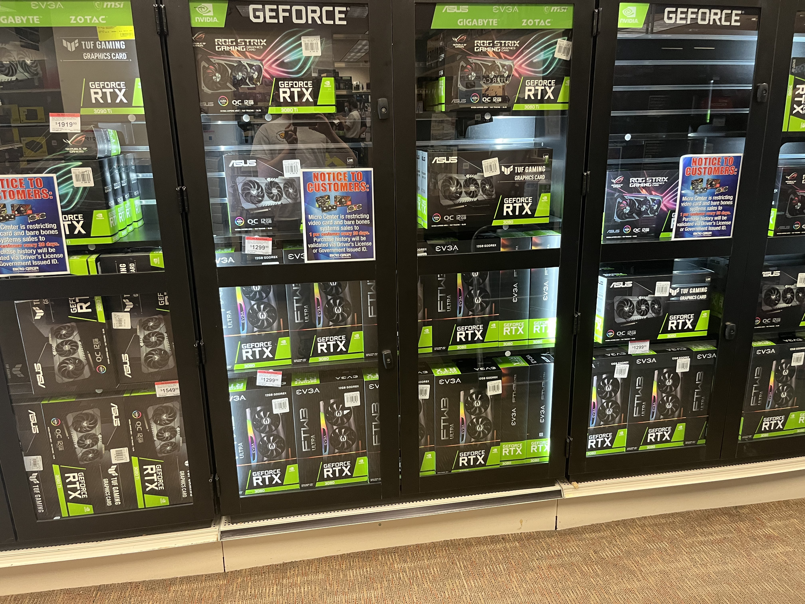

<!--
 Copyright (c) 2022 Aiden Baker

 This software is released under the MIT License.
 https://opensource.org/licenses/MIT
-->

# I Got an RTX 3060

The other day I was going to my local Micro Center looking to pick out a laptop to buy in a few weeks. However, when I was there, I found they were fully stocked with RTX GPUS.

So immediately I knew I had to get one. I had about $440 on me at the time, but the GPU I wanted (the cheapest one there at the time, [an Asus RTX 3060](https://rog.asus.com/us/graphics-cards/graphics-cards/rog-strix/rog-strix-rtx3060-o12g-gaming-model/))was about $520 (including the 6% tax in MA)

My dad covered the extra $100 dollars for me, so I owe him said money on the next pay cycle from work.

I was trying to save for the Steam deck I ordered a while back, but I assume it will take a while so I took the risk and bought it. I feel the 3060 is a much better investment. I actually went to the store to look at new laptops as I wasn't happy with the new replacement display for my laptop (as detailed in [There's always a catch with aftermarket parts](/pages/2022/april/7th.md))

I haven't messed with it much, (Of course I played minecraft RTX with it!) but from what I've done so far its pretty amazing. I was able to play Hitman 3 at full graphics with HDR at around 40fps, while streaming it to a friend on discord. I was told I was going to be disappointed by the 3060's performance since its not the TI version, but I was upgrading from a 5 year old [RX 480 from MSI](https://www.msi.com/Graphics-Card/Radeon-RX-480-GAMING-X-8G/Specification) so to me it was a massive upgrade none the less.

I tried doing a massive map on Teardown from the Steam workshop, which it mostly handled fine. I expected better performance when I really produced tons of particles, but you can't have it all I suppose.