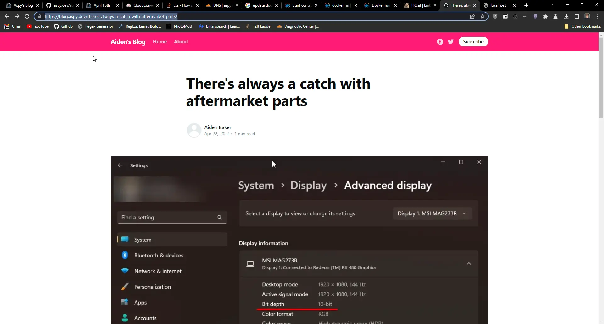

# The convoluted plans for the future of this blog

For the past few days I've been working on converting the entire blog to [Solid.JS](https://www.solidjs.com). I haven't really made much progress and its kinda disappointing. I started making the website routes and what not, but after that I realized I really didn't even know what I wanted the blog to look like and kinda got stuck there. I also tried setting up a system of automatically making routes to pages I upload but it seems that isn't feasible which is also a major setback as that was supposed to be one of the key features. What really put the final nail in the coffin for me was the fact that I couldn't really just render markdown, meaning I couldn't just write and publish, I'd have to make actual html for each page.

I might come back to it at some point later, but for the current moment its just stressing me out.

Failing that, I decided to go to [Ghost](https://ghost.org). I thought of it because I set up a blog for someone else using Ghost ([blog.6vz.dev](https://blog.6vz.dev)) and it looked pretty good. Or, better than my trashy Docsify setup here. Regardless, I decided to give it a go. I SSHed into my VPS and spun up a docker container for it. (In my experience, Docker has always been a pain. It's more that I don't actually know how to use it though. I *should* make learning to use it a priority, but whatever.) so I set that up and logged in and moved my articles. It supported markdown, which is great, but I immediately started noticing some issues. I uploaded the image for [my aftermarket part rant](/pages/2022/april/7th.md) and immediately noticed that the image isn't loading in the editor. Weird, but not something I worried about. so I posted the article, it looked meh. But here's where the real problems start: I hit the home button in the navbar and it sent me to localhost. What the fuck? I have the entire thing reverse-proxied using Nginx. That's when I decided to pull the plug on Ghost.

Either way, looks like I'll be sticking with docsify for the time being. Don't get me wrong, docsify is great for docs, as thats what its made for. I'm using it for a blog, and its quite clunky being used as a blog.

[The code for the unfinished Solid.JS version of the blog can be found on github.](https://github.com/SomeAspy/blog.aspy.dev/tree/Solid.JS) (It's the same repo as this blog version, different branch.)