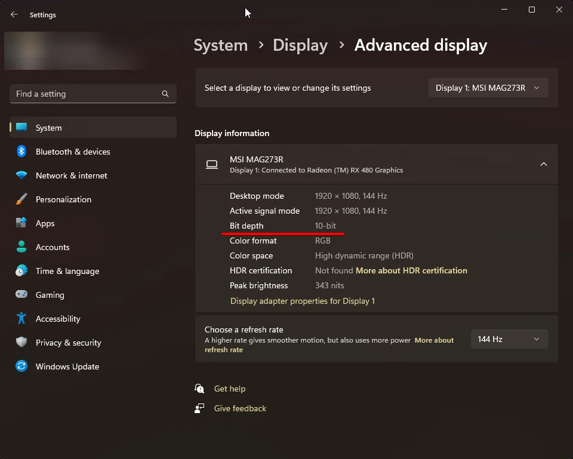

# Theres always a catch with aftermarket parts

Recently I cracked my laptop display. (My laptop is an HP Envy x360 for those wondering about [specs.](https://support.hp.com/us-en/document/c06449252))
It didn't bother me too much but I wanted to get it fixed, so I bought a replacement display. [This one specifically](https://www.amazon.com/gp/product/B087TGJZHW)
The old display was cracked in the corner, but it disabled the touchscreen for 75% of the display. The new one was advertised as having a touchscreen while being remarkably cheap, ($165.99 USD at the time of writing) So I bought it as it has good reviews (4.4/5 at time of writing) Once it came I replaced the display without any major problems,
however the edges didn't really sit flush with the frame, but thats not the part that bothers me. Upon booting into windows, I immediately noticed the colors all looked pale...

**_This display only has a depth 6-bit_**

Now to most people, thats not really a concern. To someone who doesn't care about monitors much, it wouldn't matter. Except I do. I remember before the replacement my display had 8-bit color depth. Now, 8-bit vs 6-bit doesn't sound like such a big deal, but it is. 8-bit depth displays are capable of producing 256 shades on any given color. On the other hand, 6-bit is only capable of 64 shades. After this is combined with the amount of colors that can be displayed, this is a difference of <u>several million</u>. (262,144 in 6-bit vs 16,777,216 in 8-bit) This difference (To me at least) is painfully obvious. [The monitor I'm writing this on](https://www.msi.com/Monitor/Optix-MAG273R) is actually 10-bit. (1,073,741,824 colors) 10-bit is what is called HDR.

If you are curious about what your device's bit depth is, you can check under System > Display > Advanced display (assuming you are on Windows 11)

